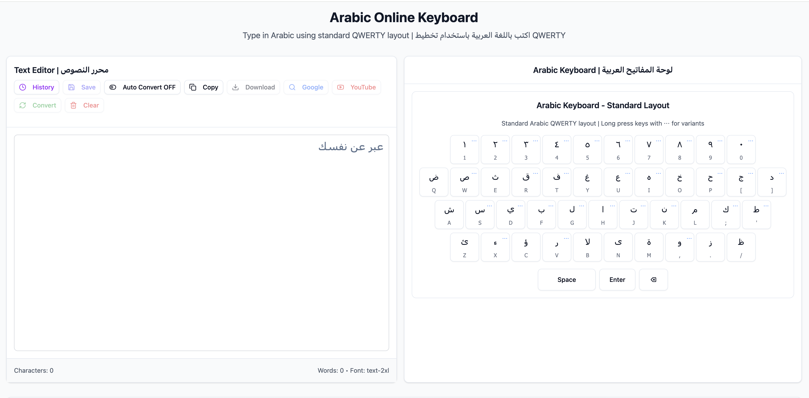

# 🔤 Arabic Online Keyboard | لوحة المفاتيح العربية

A modern, feature-rich Arabic virtual keyboard web application built with React, TypeScript, and Tailwind CSS. Type Arabic text effortlessly with phonetic conversion, smart auto-save, and comprehensive text management features.



## ✨ Features

### 🎯 **Core Functionality**
- **Virtual Arabic Keyboard**: Standard QWERTY layout with Arabic characters
- **Phonetic Conversion**: Intelligent English-to-Arabic phonetic mapping
- **Auto-Convert Mode**: Real-time transliteration as you type
- **Split-Screen Layout**: 50/50 responsive design for optimal workflow

### 🧠 **Smart Text Management**
- **Dynamic Font Sizing**: Font automatically adjusts based on word count
- **Smart Auto-Save**: Intelligent history saving with duplicate prevention
- **Text History**: Persistent storage with similarity detection
- **Manual Save**: Instant save option for important content

### 🔍 **Search Integration**
- **Google Search**: Direct search with Arabic text
- **YouTube Search**: Find Arabic content on YouTube
- **One-Click Actions**: Seamless integration with search engines

### 📱 **User Experience**
- **Responsive Design**: Works perfectly on desktop, tablet, and mobile
- **Long-Press Variants**: Access Arabic letter variants (ـً، ـٌ، ـٍ)
- **RTL Support**: Proper right-to-left text rendering
- **Copy & Download**: Export your text instantly

### 🎨 **Modern UI**
- **Clean ShadCN Design**: Professional, accessible components
- **Smooth Transitions**: Fluid animations and state changes
- **Visual Feedback**: Clear button states and user interactions
- **Bilingual Interface**: English/Arabic labels and descriptions

## 🚀 Quick Start

### Prerequisites
- **Node.js** (v18 or higher)
- **pnpm** (recommended) or npm

### Installation

```bash
# Clone the repository
git clone <repository-url>
cd arabic-keyboard

# Install dependencies
pnpm install

# Start development server
pnpm dev
```

The application will be available at `http://localhost:5173`

## 🛠️ Available Scripts

```bash
# Development
pnpm dev          # Start development server with hot reload

# Building
pnpm build        # Build for production
pnpm preview      # Preview production build

# Code Quality
pnpm lint         # Run ESLint checks
```

## 🎯 Usage Guide

### Basic Typing
1. **Click keys** on the virtual keyboard to type Arabic characters
2. **Use physical keyboard** with phonetic conversion enabled
3. **Toggle Auto-Convert** for real-time English-to-Arabic translation

### Phonetic Conversion Examples
- `ahlan wa sahlan` → `أهلاً وسهلاً`
- `bayt` → `بيت`
- `shukran` → `شكراً`
- `th` → `ث`, `kh` → `خ`, `sh` → `ش`

### Font Sizing
Text automatically resizes based on content length:
- **< 10 words**: Large (24px) - Perfect for titles
- **< 15 words**: Medium-Large (20px) - Brief messages
- **< 20 words**: Medium (18px) - Paragraph starters
- **< 30 words**: Normal (16px) - Standard text
- **30+ words**: Small (14px) - Long documents

### History Management
- **Auto-Save**: Intelligent saving every 3 seconds when content changes significantly
- **Manual Save**: Click the "Save" button for immediate storage
- **Smart Duplicates**: Advanced similarity detection prevents redundant saves
- **Quick Actions**: Load, copy, download, or delete any saved text

## 🏗️ Technical Architecture

### Frontend Stack
- **React 19**: Latest React with modern hooks and features
- **TypeScript**: Full type safety and enhanced developer experience
- **Vite**: Lightning-fast build tool with HMR
- **Tailwind CSS**: Utility-first styling framework

### UI Components
- **ShadCN UI**: Modern, accessible component library
- **Radix UI**: Headless components for complex interactions
- **Lucide React**: Beautiful, consistent icons

### Key Features Implementation
- **LocalStorage API**: Persistent history with smart management
- **Custom Hooks**: Reusable logic for text editing and conversion
- **Responsive Design**: Mobile-first approach with breakpoint system
- **Performance Optimization**: Efficient rendering and state management

## 📂 Project Structure

```
src/
├── components/           # React components
│   ├── ui/              # ShadCN UI components
│   ├── ArabicKeyboard.tsx
│   ├── HistoryModal.tsx
│   └── VariantPopover.tsx
├── hooks/               # Custom React hooks
│   └── useTextEditor.ts
├── lib/                 # Utility functions
│   ├── localStorage.ts  # History management
│   └── utils.ts        # General utilities
├── data/               # Static data
│   └── arabicVariants.ts
├── App.tsx             # Main application
└── main.tsx           # Entry point
```

## 🌟 Key Components

### `useTextEditor` Hook
Central logic for text manipulation, phonetic conversion, and auto-save functionality.

### `ArabicKeyboard` Component
Virtual keyboard with standard Arabic QWERTY layout and variant support.

### `HistoryModal` Component
Advanced text history management with search, filter, and batch operations.

### Smart Auto-Save System
Intelligent saving algorithm that prevents duplicates and saves only meaningful changes.

## 🔧 Configuration

### Phonetic Mapping
The application includes comprehensive English-to-Arabic phonetic mapping:
- Single characters: `a` → `ا`, `b` → `ب`
- Multi-character combinations: `th` → `ث`, `kh` → `خ`, `sh` → `ش`
- Case sensitivity: Supports both lowercase and uppercase input

### Auto-Save Settings
- **Debounce**: 3 seconds after typing stops
- **Smart Triggers**: Word count +3, length change >20 chars, or 20% reduction
- **Similarity Threshold**: 80% for duplicate detection
- **Storage Limit**: 50 entries maximum

## 🌐 SEO & Accessibility

- **Comprehensive Meta Tags**: Optimized for search engines
- **Open Graph Support**: Rich social media previews
- **Schema.org Markup**: Structured data for better indexing
- **ARIA Labels**: Full accessibility support
- **Semantic HTML**: Proper document structure
- **RTL Support**: Native Arabic text direction

## 🚀 Deployment

### Build for Production

```bash
pnpm build
```

### Deploy Options
- **Vercel**: Zero-configuration deployment
- **Netlify**: Drag-and-drop deployment
- **GitHub Pages**: Free static hosting
- **Any static host**: Deploy the `dist` folder

## 🤝 Contributing

1. Fork the repository
2. Create a feature branch (`git checkout -b feature/amazing-feature`)
3. Commit your changes (`git commit -m 'Add amazing feature'`)
4. Push to the branch (`git push origin feature/amazing-feature`)
5. Open a Pull Request

## 📄 License

This project is licensed under the MIT License - see the [LICENSE](LICENSE) file for details.

## 🙏 Acknowledgments

- **ShadCN**: For the beautiful component library
- **Radix UI**: For accessible headless components
- **Lucide**: For the comprehensive icon set
- **Arabic Language Community**: For feedback and testing

---

**Built with ❤️ for the Arabic-speaking community**

*لوحة مفاتيح عربية حديثة ومتطورة للكتابة باللغة العربية على الإنترنت*
